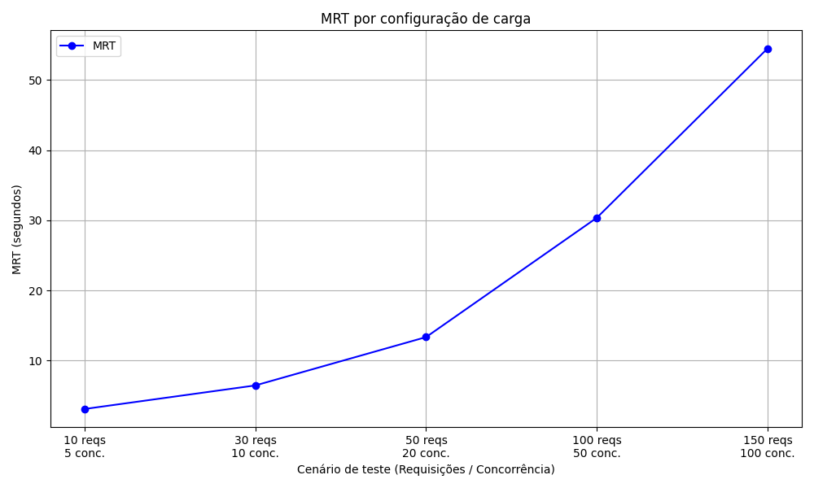

# pasid_validator_parte2
pasid validador parte 2

o comando docker-compose up --build é o comando utilizado para rodar o código.

O gráfico apresentado na imagem abaixo mostra o Tempo Médio de Resposta (MRT) em função de diferentes cenários de carga aplicados no sistema. Foram avaliadas combinações variando tanto o número total de requisições quanto o nível de concorrência (número de conexões simultâneas).

## Interpretação dos Dados

O eixo X (Cenário de Teste): Representa a quantidade de requisições e o nível de concorrência.

Eixo Y (MRT em segundos): Mostra o tempo médio de resposta de cada cenário testado.

Em cenários de baixa carga (10 requisições / 5 concorrentes), o sistema apresenta um MRT baixo, próximo de 3 segundos, indicando boa performance.

Com o aumento gradual da carga (30 reqs / 10 conc. e 50 reqs / 20 conc.), há um crescimento moderado no MRT, chegando próximo de 13 segundos.

A partir de cargas mais elevadas (100 reqs / 50 conc. e 150 reqs / 100 conc.), observa-se um aumento exponencial no MRT, ultrapassando 50 segundos no cenário mais crítico.

O sistema se mantém performático sob cargas leves e moderadas. Entretanto, sob cargas altas, ocorre uma degradação perceptível na performance, indicando possível saturação de recursos (CPU, memória, banco de dados, rede ou I/O).

# Observação:
Não conseguimos concluir a modificação recomendada dentro do prazo de envio. No entanto, continuaremos tentando para implementá-la até a próxima entrega, visando sua inclusão no artigo. 

